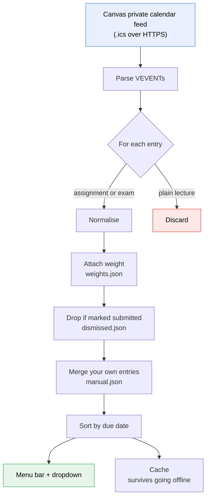
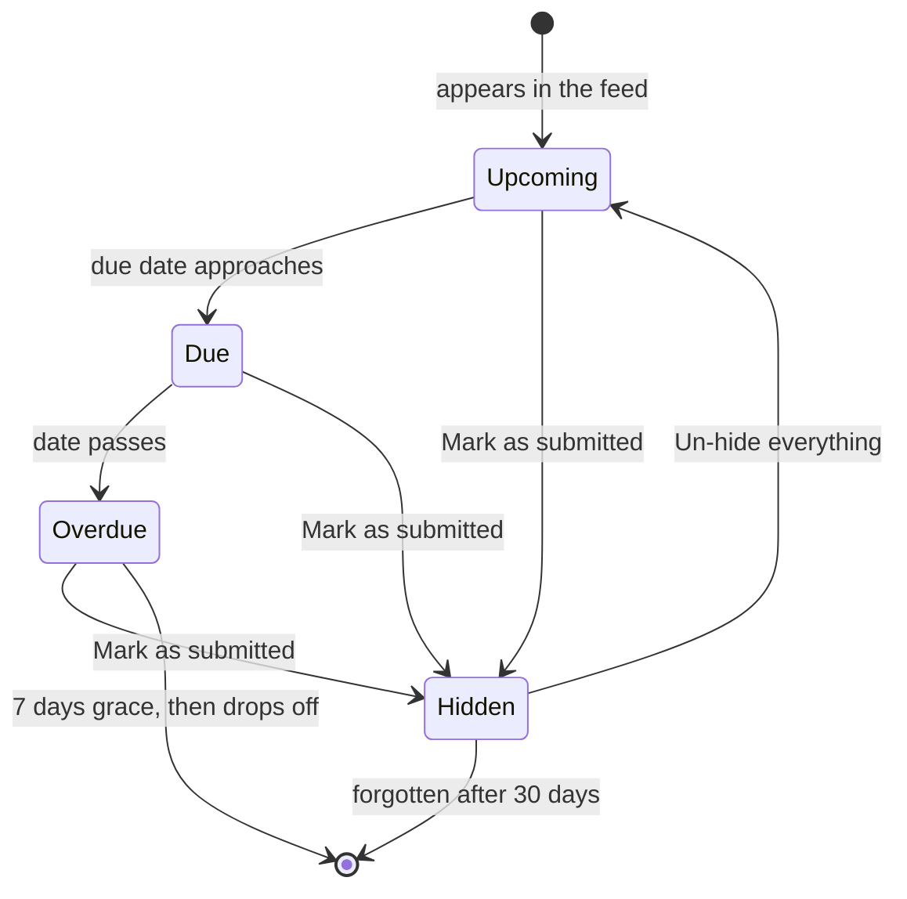

# Canvas Dates

A tiny macOS menu bar app that shows your QUT Canvas due dates — and what
each one is worth toward your final grade.

```
📅                                    ← nothing overdue
⏰                                    ← something is past due

🟡  CAB444 · 30% · Assignment 1: … - Implementation  —  Fri 11:59pm (6d)
🟡  CAB444 · 20% · Assignment 1: … - Report          —  Fri 11:59pm (6d)
🟡  IFB398 ·       Assessment 1.2: Week 7            —  Fri 11:59pm (6d)
⚪  CAB432 ·       Mid-semester Test                 —  Mon 14 Sep (2w)

Still to hand in, by unit ▸
   CAB444 — 50% of the final grade across 2 items
```

---

## Why this exists

Canvas will tell you what's due, but only if you go and look. The dashboard
is a browser tab you have to remember to open, and by the time you do, the
useful question isn't *what's due* — it's **how much does this one matter**.
A 5% weekly quiz and a 40% report are the same size on the Canvas dashboard.
They are not the same size in your week.

So this puts both in the menu bar: what's next, and what it's worth.

### The constraint that shaped everything

The obvious build is the Canvas REST API — one token, and Canvas hands over
assignments, marks, group weightings and submission status. That version was
written first and works.

Then QUT's Canvas said this:

> **Your Canvas administrators have chosen to limit your ability to generate
> your own access token.** Please reach out to your Canvas administrators to
> have them generate an access token on your behalf.

Access tokens are disabled for students. Asking IT for one takes days and may
be refused — the setting exists precisely to prevent it.

The way in is the **private calendar feed** every student can export
(Canvas → Calendar → *Calendar Feed*). No administrator involved. But the feed
is deliberately thin: titles, dates, unit codes, links. **No marks. No
weightings. No submission status.**

Most of this project is the honest handling of that gap.

| What Canvas won't give | How it's covered |
| --- | --- |
| Assessment weightings | You enter them once per semester, from your unit outlines |
| Whether you've submitted | **Mark as submitted** on any row |
| Assessment not yet published | **Add a due date…** to enter it yourself |

The API path is still in the code and still tested. If QUT ever issues a
token, flip one setting and the manual steps disappear.

---

## Features

- **Menu bar, not a browser tab.** A single calendar icon that turns into a
  clock when something is past due. Optionally shows what's next inline.
- **Percentage of your final grade** beside every item.
- **Urgency at a glance** — 🔴 today · 🟠 3 days · 🟡 this week · ⚪ later · ⏰ late
- **Per-unit summary** — "CAB444 — 50% of the final grade still to hand in".
- **Mark as submitted**, since the feed can't see what you've handed in.
- **Add your own due dates** for assessment Canvas hasn't published yet.
- **Skip a unit** whose weightings aren't out yet — due dates only, no nagging.
- **Works offline.** The last fetch is cached; an outage never blanks the list.
- **Secrets in the Keychain**, never in a file.
- **One dependency** (`rumps`) plus `certifi`. Everything else is stdlib.

---

## How it works



The three JSON files are the whole design. Each one exists because the
calendar feed is missing something the API would have provided.

### An item's life



Overdue work stays visible for a week rather than vanishing at midnight —
missing something and having it silently disappear is the worst outcome.

---

## The percentages

Canvas grades a unit one of two ways, and the app follows whichever applies:

- **Weighted groups** — each group owns a fixed slice ("Assessment 1: 50%"),
  and items inside split that slice by their marks.
- **Straight points** — an item's share is its marks over the unit total.

So a 30-mark task in a 50-mark group worth 50% is **30%** of the unit. This
matters at QUT, where one assignment is often several graded submissions —
CAB444's Assignment 1 is an Implementation (30 marks) and a Report (20).

On the calendar-feed path you enter these yourself:

```bash
./set-weights.command          # or: .venv/bin/python -m canvasdates.cli weights
```

It walks each unit and asks:

```
Enter    skip this item
s        skip this whole unit — due dates only, no nagging
q        stop and save
```

At the end it totals each unit so you can check against 100. **It never
normalises to make the numbers look tidy** — if a unit adds to 50 because
Assessment 2 isn't published, it says 50 and keeps saying so.

**Where to find the weightings:** Canvas → the unit → **Grades**. If weighted
groups are on, the table on the right lists each group's share. No table means
straight points.

---

## Install

Requires macOS and Python 3.9+.

```bash
git clone https://github.com/khokharzain/canvas-dates.git
cd canvas-dates
./install.sh
```

The installer creates a virtual environment, installs certificates, asks for
your calendar feed link, walks you through the weightings, and registers a
LaunchAgent so it starts at login.

### Getting your calendar feed

1. Canvas → **Calendar** in the left sidebar
2. Scroll the right-hand column → **Calendar Feed**
3. Copy the link

**Treat it like a password** — anyone holding it can read your calendar. It
goes into the macOS Keychain, not a file.

### Using an API token instead

If your institution allows student tokens, you get weightings and submission
status automatically. Set `"source": "token"` in
`~/.config/canvas-dates/config.json`, then run
`.venv/bin/python -m canvasdates.cli setup`.

---

## Commands

```bash
./restart.command                             # after pulling changes
./set-weights.command                         # enter assessment weightings
./uninstall.sh                                # remove the login item

.venv/bin/python -m canvasdates.cli list      # print what's due
.venv/bin/python -m canvasdates.cli doctor    # diagnose problems
.venv/bin/python -m canvasdates.cli setup     # reconnect the calendar

python3 selftest.py                           # 56 offline checks, no network
```

### Adding a due date

**Add a due date…** in the dropdown. One line:

```
CAB444 | Assignment 2 | 15 Oct | 50
```

The `%` is optional. `15 Oct`, `15 Oct 5pm`, `2026-10-15` and `15/10/2026`
all parse; no time means 11:59pm.

---

## Limitations

Worth knowing before you rely on it:

- **Weightings are only as good as what you type.** They come from your unit
  outline, not from Canvas. Drop-lowest rules and extra credit aren't modelled.
- **It can't see submissions** on the feed path. If you don't mark something
  submitted, it keeps showing.
- **Unpublished assessment is invisible.** A 50% exam with no Canvas entry
  doesn't exist to the app until you add it by hand.
- **Assessment-shaped calendar events only.** Events are included when the
  title reads like assessment (*exam, test, quiz, midsem…*), otherwise your
  whole timetable would flood the list. Settings can override this.
- **macOS only.** It's a menu bar app.

---

## Layout

```
canvasdates/
  config.py     settings, Keychain secrets, cache
  icsfeed.py    .ics fetch and parse — line unfolding, escapes, TZID, all-day
  canvas.py     read-only REST client (the API path)
  store.py      weights / dismissed / manual, with tolerant title matching
  items.py      the DueItem model, formatting, hand-typed date parsing
  fetcher.py    both sources, weighting maths, source dispatch
  app.py        the rumps menu bar UI
  cli.py        setup · weights · list · doctor
selftest.py     56 checks against a fake Canvas
```

### Testing

```bash
python3 selftest.py
```

No network, no feed, no token, config isolated to a temp directory. Three
parts: the calendar-feed pipeline, the API pipeline, and the menu itself —
built against an injected `rumps` stub so the UI code is covered on any
machine, including CI.

---

## Licence

MIT. See [LICENSE](LICENSE).
